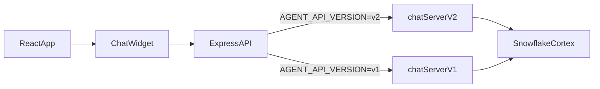

# Snowflake Cortex Agents Chat Application

Drop-in chat widget + Express proxy for Snowflake Cortex Agents (v1 and v2) with PAT or OAuth, threading, and ready-to-copy integration points.

## What this repo gives you
- Frontend widget (`packages/simple-chat-interface/`) you can embed in any React app.
- Backend routers (`server/chatServer.js` for v2, `server/chatServerV1.js` for v1) you can mount in any Express app.
- Sample full app (create-react-app + Express) wired together with auth, threading, and streaming.

## Quick start (5 minutes)
1. Install deps: `npm install`
2. Copy envs:
   - Backend: `cp env.backend.example .env` (pick the closest `env.*.example` from the modes table below and copy its values into `.env`)
   - Frontend: `cp env.frontend.example .env.local`
3. Fill `.env` with your Snowflake host/db/schema and PAT or OAuth settings.
4. Validate config: `npm run check:config` (fails fast if required vars are missing).
5. Run everything: `npm run start:all` → frontend `http://localhost:3000`, backend `http://localhost:3001`.

## Choose your mode
| Mode | When to use | Key env vars | Example file | Run tip |
| --- | --- | --- | --- | --- |
| v2 (default) | Use Snowflake agent registry + threads API | `AGENT_API_VERSION` (default v2), `AUTH_MODE` (PAT or OAUTH) | `env.v2.example` | `npm run check:config && npm run start:all` |
| v2 inline spec | One fixed agent with custom inline spec, still v2 API | `FIXED_AGENT_NAME`, `AGENT_SPEC_FILE`, `AUTH_MODE` | `env.v2.inline.example` | Same as above |
| v1 | Legacy API + SQL execution + in-memory threads | `AGENT_API_VERSION=v1`, `FIXED_AGENT_NAME`, `AGENT_SPEC_FILE`, `SNOWFLAKE_WAREHOUSE`, `AUTH_MODE` | `env.v1.example` | `AGENT_API_VERSION=v1 npm run start:server` |
| v1 hybrid | RLS via OAuth claims + shared PAT for Snowflake | v1 vars above + `SNOWFLAKE_PAT`, `SESSION_VAR_NAME`, `CLAIM_KEY`, OAuth + `IDP_JWKS_URL` | `env.hybrid.example` | `AUTH_MODE=OAUTH npm run start:server` |

## Architecture at a glance


## Config reference (backend `.env`)
- Core: `SNOWFLAKE_HOST`, `SNOWFLAKE_DATABASE`, `SNOWFLAKE_SCHEMA`.
- API version: `AGENT_API_VERSION` (`v2` default, `v1` requires inline spec + warehouse).
- Auth: `AUTH_MODE` (`PAT` → `SNOWFLAKE_PAT`; `OAUTH` → `OAUTH_TOKEN_URL`, `OAUTH_CLIENT_ID`, `OAUTH_CLIENT_SECRET`, `OAUTH_REDIRECT_URI`).
- Inline spec: `FIXED_AGENT_NAME` + `AGENT_SPEC_FILE` (JSON).
- v1 SQL: `SNOWFLAKE_WAREHOUSE`.
- Hybrid (v1): `SESSION_VAR_NAME`, `CLAIM_KEY`, `SNOWFLAKE_PAT`, `IDP_JWKS_URL` (+ optional `IDP_ISSUER`, `IDP_AUDIENCE`).
- Quick check: `npm run check:config`.

## Run, demo, and self-test
- Validate: `npm run check:config`.
- Start everything: `npm run start:all` (or backend only `npm run start:server`).
- Demo presets: `npm run demo:pat` (shared PAT), `npm run demo:oauth` (OAuth login).
- Smoke tests (after server is up):
  - Health: `curl -i http://localhost:3001/health`
  - Agents (v2 or inline): `curl -i http://localhost:3001/api/agents`
  - Send message (replace `<agent>` and payload as needed):
    ```bash
    curl -N -X POST http://localhost:3001/api/agents/<agent>/messages \
      -H "Content-Type: application/json" \
      -d '{"messages":[{"role":"user","content":"hello"}]}'
    ```
  - v1 SQL check: ensure `SNOWFLAKE_WAREHOUSE` is running and PAT has execute privileges.

## Embed in your own app
- Frontend: `npm install ./packages/simple-chat-interface` then wrap your app with `ChatThemeProvider` and drop in `FloatingChatInterface` pointing at your backend URL.
- Backend: mount the router:
  ```js
  const { createChatRouter } = require('./server/chatServer');
  app.use('/api', createChatRouter({
    snowflakeHost: process.env.SNOWFLAKE_HOST,
    snowflakeDatabase: process.env.SNOWFLAKE_DATABASE,
    snowflakeSchema: process.env.SNOWFLAKE_SCHEMA,
    getAuthToken: (req) => process.env.SNOWFLAKE_PAT || req.tokens?.accessToken
  }));
  ```
  For v1, swap to `createV1ChatRouter` and ensure `AGENT_SPEC_FILE` + `SNOWFLAKE_WAREHOUSE` are set.

## Project layout
```
server/                   Express server + routers + config helpers
packages/simple-chat-interface/   React widget package
src/                     Sample CRA frontend
env.*.example            Mode-specific env templates
summary_docs/            Teaching and change summaries
```

## Troubleshooting (fast lane)
- 401 in OAuth: confirm `OAUTH_*` and `IDP_JWKS_URL`; clear cookies and retry.
- 400 from Snowflake: verify database/schema and agent names exist (case-sensitive).
- v1 SQL fails: check `SNOWFLAKE_WAREHOUSE` running and PAT permissions; rerun `npm run check:config`.
